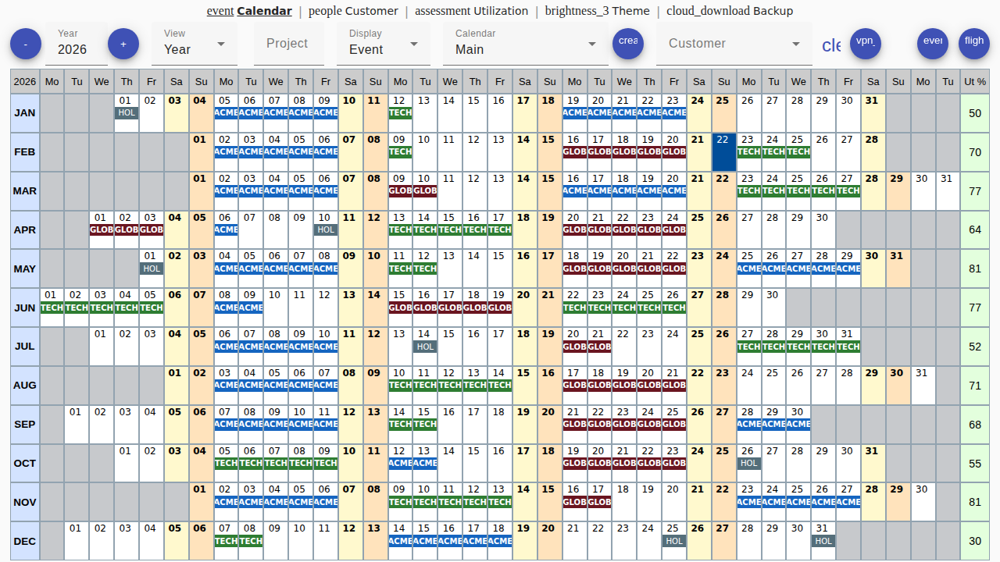
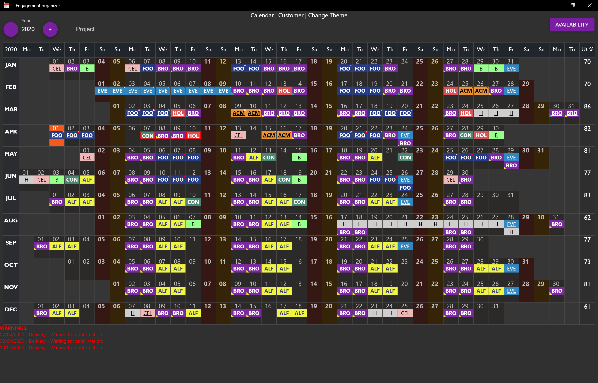
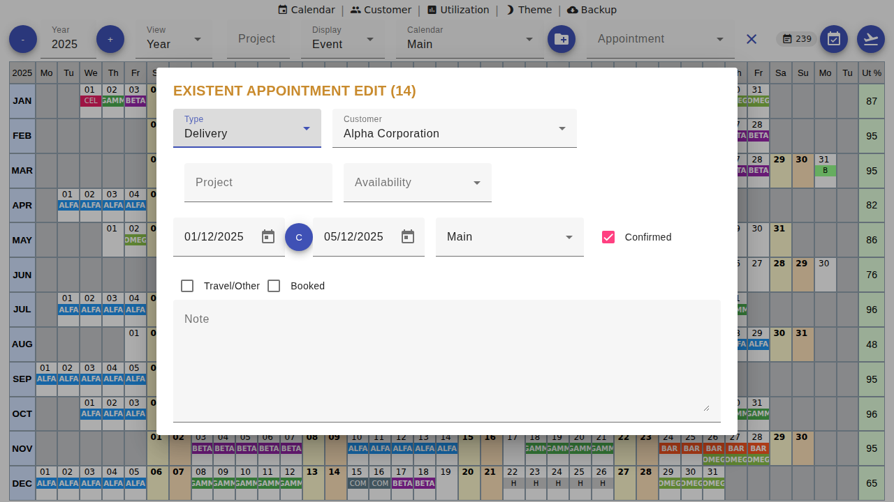
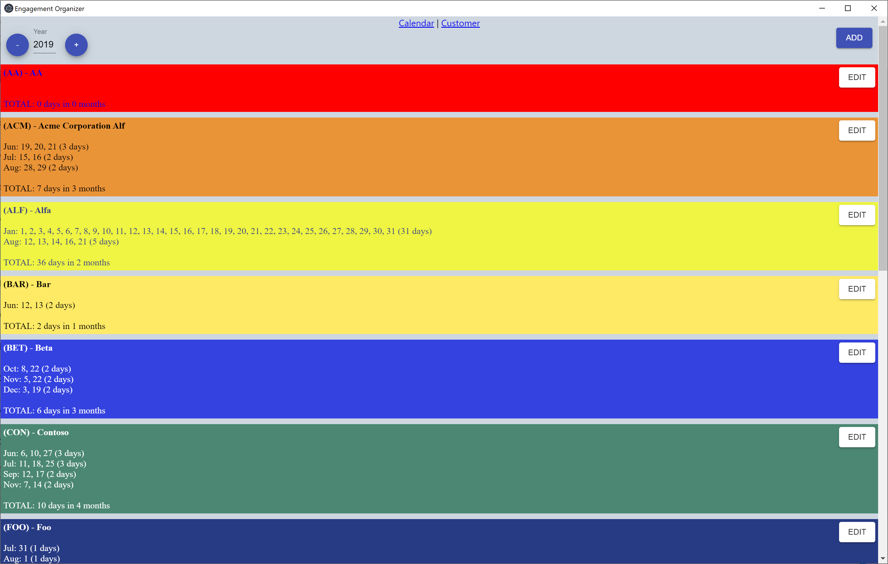

# Organizer
[](https://github.com/liguori/organizer/actions/workflows/build-frontend.yml)
[](https://github.com/liguori/organizer/actions/workflows/build-backend.yml)

Appointment management tool. 

 ## Technologies

- Angular
- Angular Material
- ASP.NET Core
- Entity Framework Core
- SQLite
- Electron
- .NET Aspire (for orchestration)

## Introduction

This tool represents a proof of concept. The quality of the code whose completion times were in the order of a few days in my spare time is proof of that (minimum valuable product).

## Build

Requirements: You need to install NodeJS 22+ and .NET 10 SDK.

Execute the `Build.ps1` PowerShell script from the repository root. (PS Core for Linux/Mac or execute the .ps1 commands in your favourite console)

```bash
./Build.ps1
```

Once the build is completed, you can run the self-contained Electron application from the `./src/dist` folder.

### Build with .NET Aspire

To build and run using .NET Aspire orchestration:

```bash
cd src
dotnet build Organizer.Aspire.sln
```

## Areas for improvement

- Unit testing
- CI / CD
- Globalization and i18n
- Bug fix
- Transform hard-coded HTML in Angular Component using tamplates


## Screenshots

**Calendar view**

Light Theme

Dark Theme


**Appointment editing**


**Available days**


**Customer Summary**


## Hosting Models
**Architecture**

The app is composed of 3 layers:
- API: The REST api that wraps all the business logic and data access (./src/Organizer.API)
- SPA: The Single Page Application that represents the user interface (./src/Organizer.SPA)
- Electron: Can host the API and SPA for a standalone usage (./src/Organizer.App)

### .NET Aspire Orchestration (Recommended for Development)

The application includes .NET Aspire 13.1.0 orchestration for simplified development and deployment. Aspire provides:
- Unified orchestration of the API and SPA
- Built-in service discovery
- Observability with OpenTelemetry
- Health checks and resilience
- Dashboard for monitoring

To run with Aspire:

```bash
cd src/Organizer.AppHost
dotnet run
```

This will start:
- The Organizer.API (ASP.NET Core Web API)
- The Organizer.SPA (Angular application)
- The Aspire Dashboard for monitoring and observability

Access the Aspire Dashboard at the URL shown in the console output (typically https://localhost:17256).

**Web Application**

The application can be hosted as a web application, you just need to build and deploy in a web server the following components:
- API
- SPA

**Electron Application**

The GitHub Release or the output of the `Build.ps1` command will produce a standalone Electron application (v40.x) that can be directly executed. 
